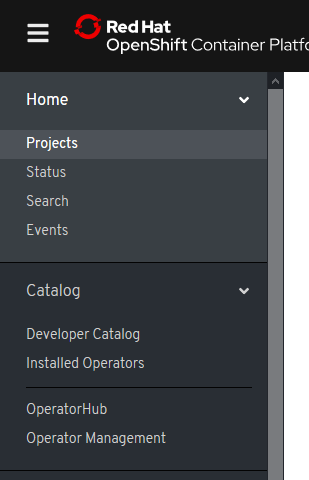
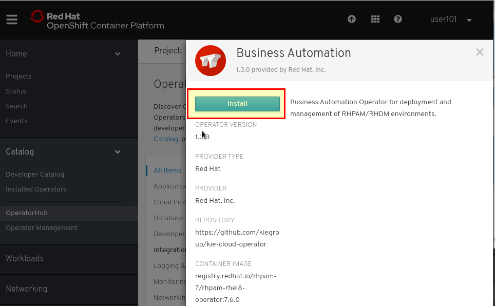
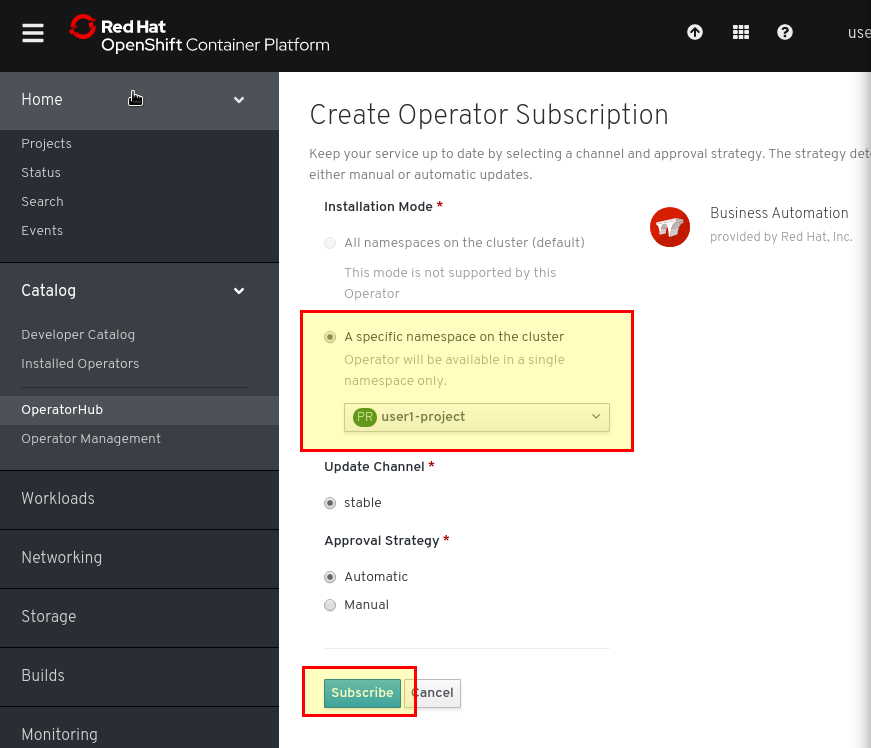
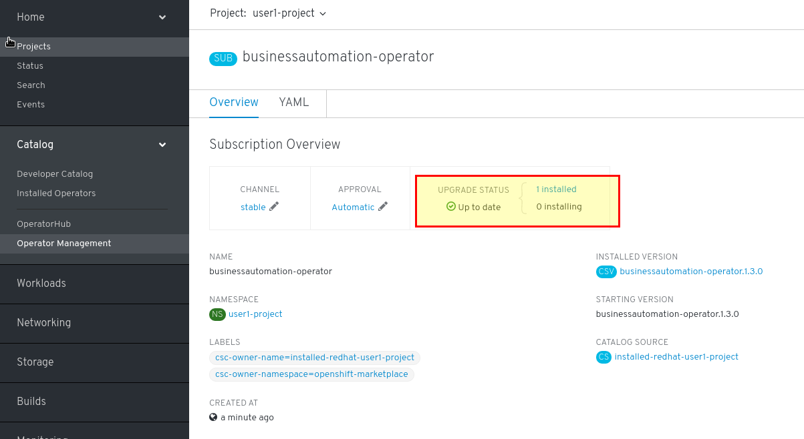
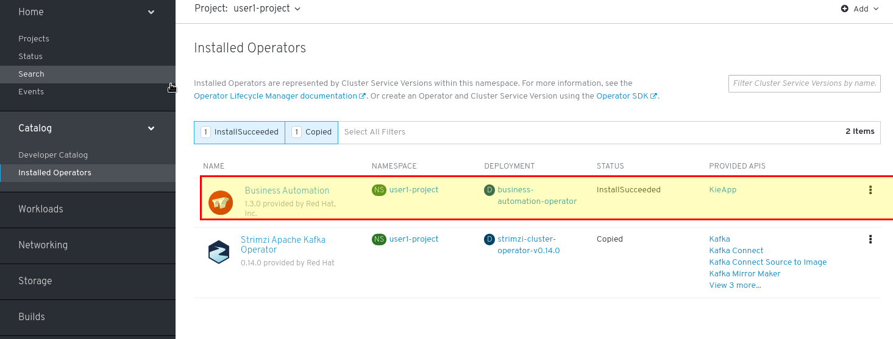
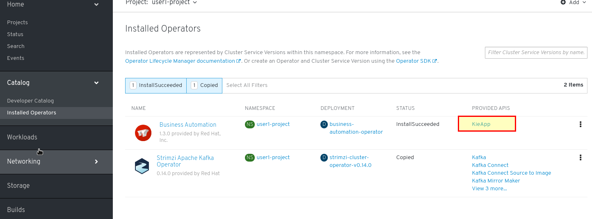
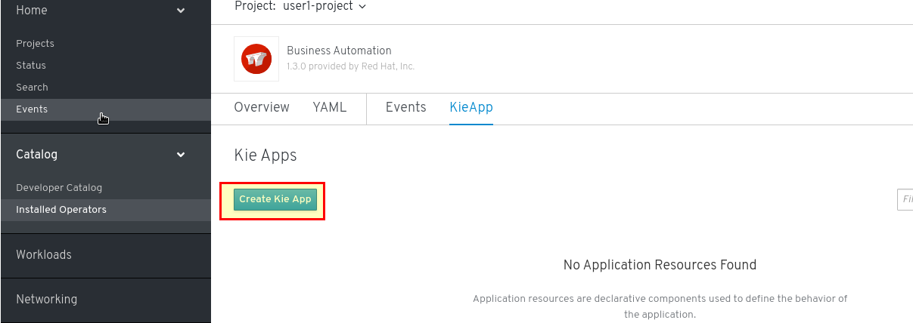
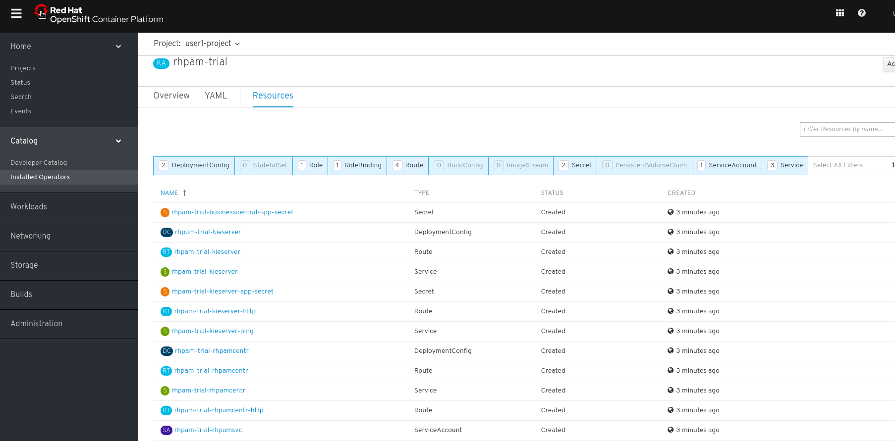

# Install and Configure Decision Manager (DM)

In OpenShift 4.2 the installation of Process Automation Manager (PAM) or Decision Manager (DM) is performed primarily through Operators. For developers who just want to use the product, Operators offer a very simple usage model: the developer can specify the set of capabilities/configuration he or she needs (e.g. PAM or DM), and the operator is responsible for provisioning and configuring the product to provide the required capabilities.

1. Because your "normal" user account (e.g. userNN) does not have OpenShift cluster administrator privileges, you are not able to install the Business Automation operator with your regular user account. In order to do accomplish that, logout from the OpenShift console and log in using your admin credentials user<100+NN> (e.g. if you're *user2*, your "privileged account" is *user102*)


2. As your privileged user, navigate to the **Catalog -> Operator Hub** section, and search for **Automation** in the search box.




3. Click on the **“Business Automation”** operator tile and click on the **Install** button to install the operator.


1. On the **Create Operator Subscription** screen, choose the option to install the operator in **A specific namespace on the cluster** and choose your normal user's project (e.g. userNN-project) in which the subscription will be created. Leave the default settings for the "Update Channel" and "Approval Strategy" options and click the **Subscribe** button.



4. The subscription page for the "businessautomation-operator" will be displayed. After a few moments, the **Upgrade Status** will get a green checkmark and indicate that it is **Up to Date**, indicating that the platform has installed the operator in the namespace




5. Log out from the "privileged" account (e.g. user<100+NN>) and log back in as the "regular" user account (userNN). Now, navigate to the the **Catalog** -> **Installed Opreators** from the main menu. You should see the newly subscribed Business Automation operator. Click into the operator tile, and on the Operator details page, click the “Create Instance” link/button




NOTE:  If you get an “Unauthorized” error on the page, make sure that the “Project” dropdown at the top left of the page has your new “userNN-project” project selected.



6. Click on the **KieApp** link from the **Installed Operators** screen, and click the **Create Kie App** button.



**NOTE**: If you're puzzled by the meaning of **kie** in KieApp, possibly kieserver (the runtime for executing rules), it stands for "Knowledge is Everything".

**NOTE** : As we progress through the lab, you will see references to "Business Central". Business Central is the web UI that Decision Manager and Process Automation Manager provide users with the ability to author processes, rules, test and deploy processes, etc.

7. Accept the default values and click the **Create** button to proceed with the creation of the KieApp custom resource (be sure to replace userNN-project with your actual project name)

```yaml
apiVersion: app.kiegroup.org/v2
kind: KieApp
metadata:
  name: rhpam-trial
  namespace: userNN-project
spec:
  environment: rhpam-trial
```

   The **spec.environment** value in the yaml document is most important - it specifies how the product will be deployed. There are other “environment” values that can be used for production, HA, authoring, etc (e.g. rhpam-trial,  rhpam-authoring, rhpam-authoring-ha, etc)  - more details are available on the [OpenShift PAM/DM installation documentation](https://access.redhat.com/documentation/en-us/red_hat_decision_manager/7.6/html/deploying_a_red_hat_decision_manager_environment_on_red_hat_openshift_container_platform_using_operators/operator-con) .


7. Now, stop and explore - let's see how the product is running in OpenShift:
* First click on the blue **rhpam-trial** KieApp. You will see some summary information about the application the operator is creating


* Then select the **Resources** tab and observe the many resources that just got created in the project. If you had tried to install Decision Manager on your own, you would have had to create all of these resources on your own and would have had to make sure that they all work together as they should. The Business Automation operator did all of that work for you based on the custom KieApp resource.



* On the left click on the **Workloads** -> **Deployment Configs**  in the project. Note that the **Status** column indicates that they have deployed **0 of 1 pods**.


-  `STOP : Do not proceed further, spend 5 minutes to try to figure out what is happening here. `

[**NEXT LAB -> DM Operator Troubleshooting**](2_2_Troubleshoot_Operator.md)
